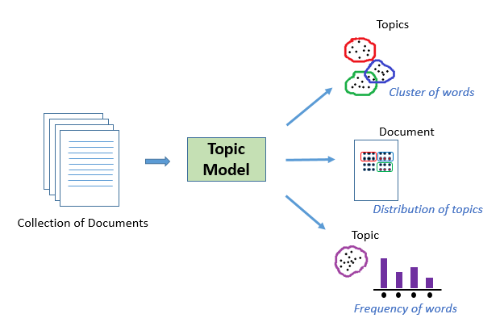
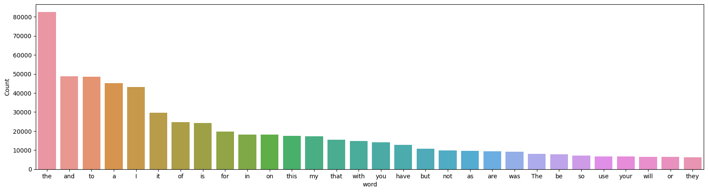
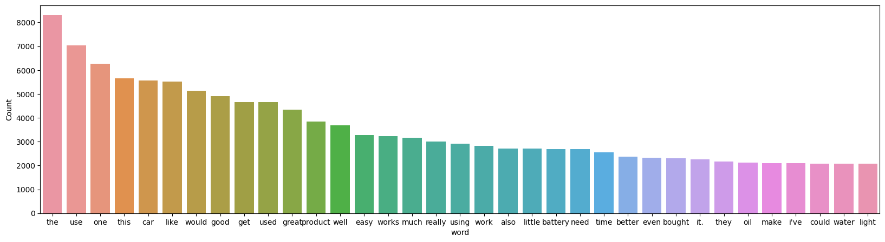
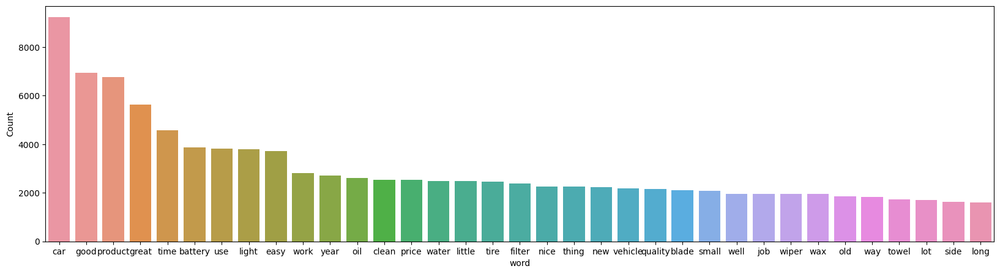
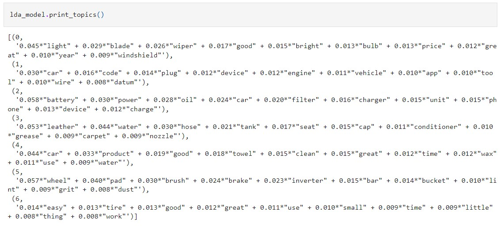

# Amazon Reviews Topic Modeling with LDA

Online product reviews provide valuable insights for both consumers and sellers. However, due to the overwhelming volume of information, an intelligent system that identifies key topics from these reviews would be beneficial. This system would:
- Allow consumers to quickly grasp the main points without reading all the reviews.
- Provide sellers with consumer feedback in the form of extracted topics.

To solve this task, we will use the concept of **Topic Modeling** (**LDA**) on Amazon Automotive Review data.
- **Dataset** : [Amazon Automotive Review Dataset](http://snap.stanford.edu/data/amazon/productGraph/categoryFiles/reviews_Automotive_5.json.gz)

### Why use Topic Modeling for this task?

Topic Modeling is a method to automatically identify topics present within a text and derive the underlying patterns within a text corpus. Topic Modellling are useful for a variety of purposes, including:
- Clustering documents
- Organizing large amounts of textual data
- Retrieving information from unstructured text
- Selecting relevant features

For example, a well-trained topic model on text related to the stock market should yield topics such as “bid,” “trading,” “dividend,” “exchange,” etc.

In our case, we have thousands of online product reviews under the 'Automotive' category. Our goal is to extract several groups of key words from these reviews. These groups represent topics that will help us understand the main theme of discussions consumers are having in their reviews.

## Data Preprocessing: Most Frequent Words

### Before Preprocessing

### After Removing Numbers, Symbols, Stopwords and Short Words (<3 Letters)

### After Lemmatization with only Nouns and Adjectives

## Topics Generated
- Built LDA Model with Number of Topics = 7.

- Topic 0 seems to be about the utilities as it has terms like light, wiper, and windshield.
- Topic 4 has terms like ‘towel’, ‘clean’, ‘wax’, ‘water’, indicating that the topic is very much related to car-wash. 

